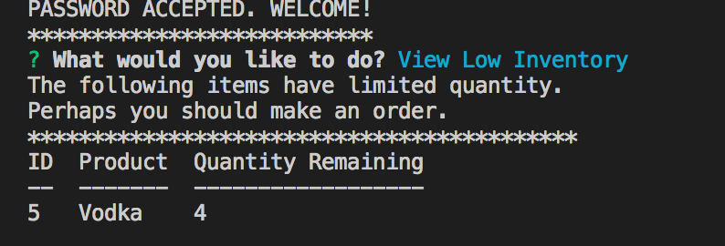

# bamazon

## Overview

Bamazon is a mock store front that is run in the command line. It offers users the options to simulate roles as both customers and a manager. As a customer, the user can simply see the store's inventory and place an order. Once an order is placed, a bill of sale is returned and the quantity updates in real time. Accessed as a manager, besides showing the storefront the app allows the user to see what specific products have low inventory and order new stock, as well as adding new products to the store complete with unique ids, names, departments, price, and quantity. These changes are then visible to the customer.

## Customer Portal

The user is prompted the id and quantity of the item they'd like to order. If there is enough stock, the total is displayed and their order is complete. If there isn't the desired quantity they are asked to place a different order.

## Manager Portal

The manager portal can only be accessed with a password (which is conveniently password for this application!). If the proper word is not inputted after the command and filename, user is denied access. Once logged in, the manager is given a prompt that displays options.

Here you can see the 'View Low Inventory' and 'Add to Inventory' functions.

Finally, as user manager has the ability to add new products.

